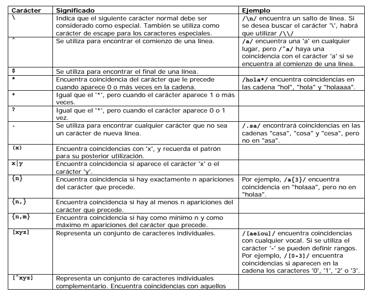

  # **Expresiones Regulares**

****
### ** Que son las expresiones regulares? **

  Las expresiones regulares tambien conocidas como **RegExp** es una secuencia de caracteres que forma un patron de busqueda, principalmente utilizadas para la busqueda de patrones de cadenas de caracteres.


****

## **2 tipos de caracteres**

Existen 2 tipos de carecteres que conforman una expresion regular.

#### *Literales*

Son los valores alfanumericos con los cuales se puede hacer una busqueda.

#### *Metacaracteres*

Lista de caracteres especiales mas utilizados en las expresiones regulares.



****

## ** Tipos Patrones **

####  ** Caracteres Literales **

Se contruye con caracteres literales para los que se desea una coincidencia exacta.

```

  var re = /ab+c/;

```

#### ** Caracteres Especiales **

Cuando la busqueda de coincidencia requiere algo mas que una coincidencia exacta.

```

  var re = /r[a-z]$/;

```

****
